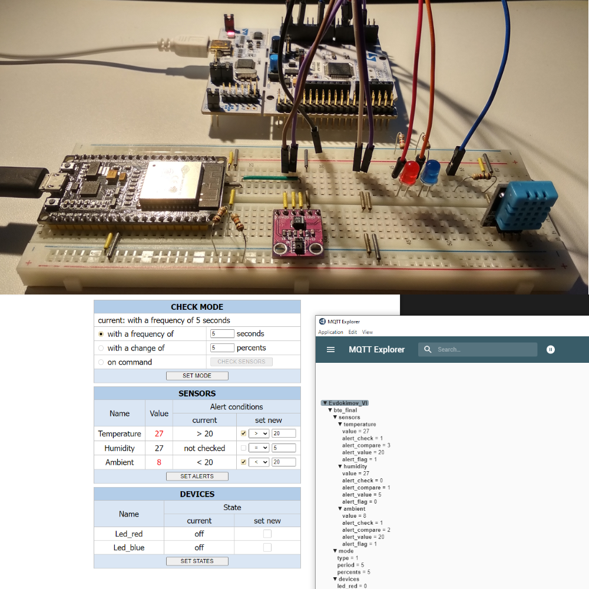

# stm32_esp32_uart_web_mqtt
In this small project following steps are realized:
- collecting sensors' data and controlling devices by STM32;
- transferring data between STM32 and ESP32 via UART using a simple messages format;
- visualization of sensors' data, modes configuration and devices control via ESP32 web-interface;
- publishing data on MQTT server.

This is a project for module "Basic Technologies of Electronics" of "Embedded Systems Developer" training course.

